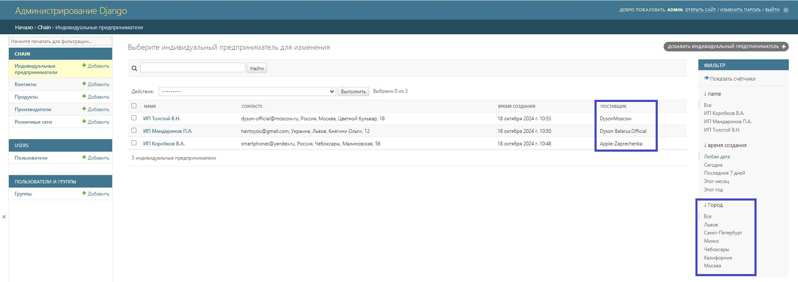

# <p align="center">Electronic chain</p>
Веб-приложение по сети продажи электроники, с API интерфейсом. 
Приложение выполнено на фреймворке Django и Django REST framework.
PostgreSQL используется для сохранения данных.

[](https://www.python.org/downloads/release/python-394/)
[](https://docs.djangoproject.com/en/4.2/releases/4.0.1/)
[](https://www.postgresql.org/docs/12/release-12-4.html)


## Использование
Для работы с данным проектом:

* Установите Git

* Клонировать репозиторий: https://github.com/vlad-prist/electronic_chain.git

* В виртуальном окружении установите **requirements.txt** (пакет с зависимостями) с помощью команды:
```sh
$ pip install -r requirements.txt
```

* Добавьте в свой проект файл **.env** необходимыми для работы паролями.
Пример **.env.sample** размещен в проекте.


* Если требуется доступ к админке, выполните команду в терминале редактора исходного кода:
(Супер пользователь ***email="admin@admin.com"*** ***password="admin123456"***)
```sh
$ python manage.py csu 
```


## Разработка

### Реализовано в проекте
В данном проекте реализовано два приложения:

`chain` - основной проект /
`users` - для регистрации пользователей

В каждом по соответствующей модели.
Для моделей реализован контроллеры через ViewSet

**users**

Реализован класс User для дальнейшего определения пользователей сервиса.
Незарегистрированные пользователи могут только просматривать Веб-приложение.

**chain**

***Структура базы данных***

* Таблица контактов;
* Таблица продуктов;
* Таблица производителя;
* Таблица розничной сети;
* Таблица ИП.

***Функциональность***

- [x] Реализованы стандартные операции CRUD (создания, чтения, обновления и удаления записей) для всех таблиц.
- [x] В админ-панели реализовано:
    * ссылка на «Поставщика»:

    * фильтр по названию города:

    * admin action, очищающий задолженность перед поставщиком у выбранных объектов:

- [x] Реализована валидация данных:
    * Запрет на обновление через API поля «Задолженность перед поставщиком»;
- [x] Добавить возможность фильтрации объектов по определенной стране.


- [x] Настроены права доступа к API, только авторизованные пользователи имеют доступ к редактированию.

___

### Структура приложения
Список URLs приложения:

| url                                                          | Описание                                                  |
|--------------------------------------------------------------|-----------------------------------------------------------|
| http://localhost:8000/admin/                                 | Панель администрирования                                  |
| http://localhost:8000/users/                                 | Панель для создания/редактирование/удаления пользователей |
| http://localhost:8000/factories/list/                        | Вывод списка всех производителей                          |
| http://localhost:8000/retailers/list/                        | Вывод списка всех розничных сетей                         |
| http://localhost:8000/traders/list/                          | Вывод списка всех ИП                                      |
| http://localhost:8000/traders/list/?contacts__country=Россия | Вывод списка всех ИП, отсортированных по стране Россия    |
| http://localhost:8000/swagger/                               | Открытая документация API. Swagger                        |
| http://localhost:8000/redoc/                                 | Открытая документация API. Redoc                          |


___

## Технические требования

1. **Язык программирования:**
    - Python 3.12
2. **Фреймворк:**
    - Django для реализации REST API с использованием Django REST Framework (DRF)
3. **База данных:**
    - PostgreSQL для хранения данных
4. **ORM:**
    - Django ORM для взаимодействия с базой данных

5. **Документация:**
    - В корне проекта размещен файл README.md с описанием структуры проекта, инструкциями по установке и запуску, а также описанием API.
6. **Качество кода:**
    - Соблюдены стандарты PEP8 для Python кода.
7. **Автодокументация:**
    - Реализована автогенерируемая документация API с использованием Swagger и/или ReDoc.

___

## Источники

1. [Документация по фреймворку и библиотекам Django](https://django.fun/)
2. DRF - Сериализаторы. Документация - [Сериализаторы](https://ilyachch.gitbook.io/django-rest-framework-russian-documentation/overview/navigaciya-po-api/serializers)
3. Обучающий материал по админке - [Пользовательские поля и действия в админ-панели](https://proproprogs.ru/django4/django4-polzovatelskie-polya-i-deystviya-v-admin-paneli)
4. Фильтры в админке - [SimpleListFilter](https://django.fun/docs/django/5.0/ref/contrib/admin/filters/)
5. Настройка CORS. Официальная документация. - [django-cors-headers](https://pypi.org/project/django-cors-headers/)
6. Интерактивная документация API. Официальная документация - [drf-yasg](https://drf-yasg.readthedocs.io/en/stable/readme.html)
